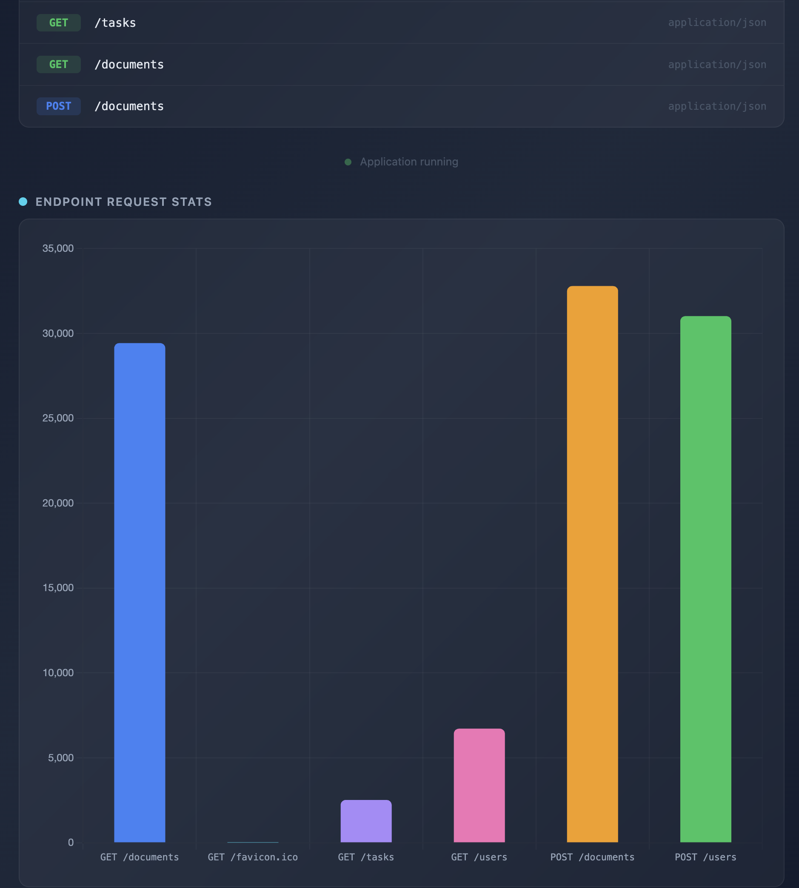

# Perf Test Target

A lightweight Go web application designed as a target for performance testing. It exposes several HTTP endpoints and tracks per-endpoint request counts in real time via a built-in dashboard.

How to run:
```
docker run -p 3000:3000 rogierlommers/perftest-target:latest
```

([link to dockerhub](https://hub.docker.com/r/rogierlommers/perftest-target/tags))



## Endpoints

| Method | Path               | Description                  |
|--------|--------------------|------------------------------|
| GET    | `/`                | Dashboard (HTML)             |
| GET    | `/users`           | List users                   |
| POST   | `/users`           | Create a user                |
| GET    | `/tasks`           | List tasks                   |
| GET    | `/documents`       | List documents               |
| POST   | `/documents`       | Create a document            |
| GET    | `/stress/cpu`      | CPU stress demo endpoint     |
| GET    | `/health`          | Health check                 |
| GET    | `/api/stats`       | Per-endpoint request counts  |
| GET    | `/api/clear-stats` | Clear all stats              |

## Configuration

The app reads environment variables from a `.env` file (via [godotenv](https://github.com/joho/godotenv)):

| Variable         | Description                          | Example          |
|------------------|--------------------------------------|------------------|
| `HTTP_BIND_ADDR` | Address the server listens on        | `0.0.0.0:3000`   |
| `LOGLEVEL`       | Log level (`debug`,`info`,`warn`,`error`) | `info`       |

## Running locally

```bash
# create a .env file with at least:
echo 'HTTP_BIND_ADDR="0.0.0.0:3000"' > .env
echo 'LOGLEVEL="debug"' >> .env

# run directly (assumes that you have Go installed)
./run-dev.sh
```

## Load testing

First start the perftest-target application. By default it binds to 0.0.0.0:3000.
Then start the locust tests. The repo comes with two locustfiles:
